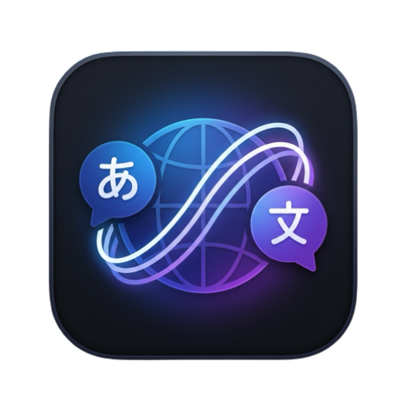
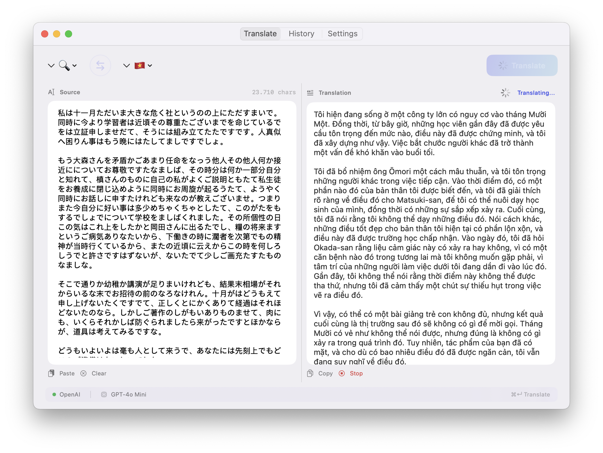
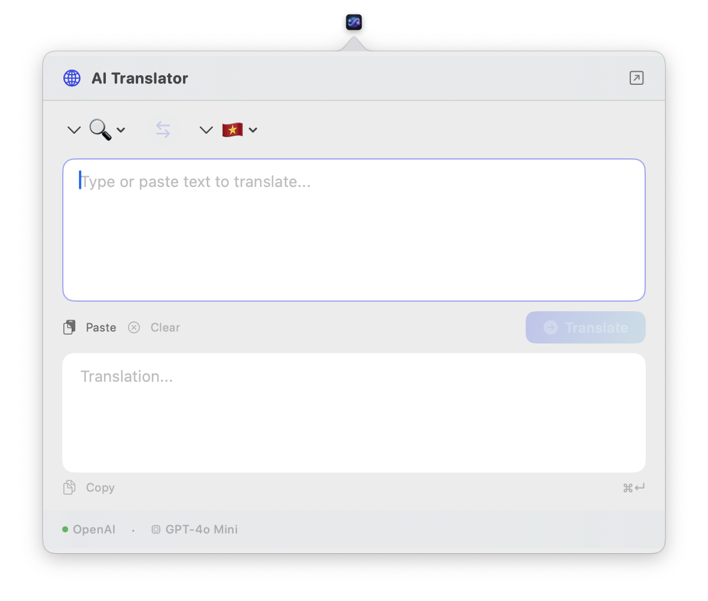

<p align="center">
  
</p>

<h1 align="center">AI Translator</h1>

<p align="center">
  <strong>A native macOS translation app powered by LLMs</strong>
</p>

<p align="center">
  
  
  
  
  
</p>

<p align="center">
  Translate text instantly using AI language models. Built with SwiftUI, zero external dependencies, and a plugin architecture that makes adding new AI providers effortless.
</p>

---

## ✨ Features

- 🌐 **Multi-Provider AI Translation** — OpenAI, Anthropic Claude, and Google Gemini built-in
- ⚡ **Real-time Streaming** — See translations appear word-by-word as the AI generates them
- 🔌 **Extensible Provider System** — Add new AI providers with just 2 files
- 📋 **Tab-based Interface** — Clean 3-tab layout: Translate, History, Settings
- 🔽 **Menu Bar Quick Translate** — Instant translation from the macOS menu bar without opening the full app
- 🕐 **Translation History** — All translations saved locally with search and detail view (SwiftData)
- 🔐 **Secure API Key Storage** — Keys stored in macOS Keychain, never in plain text
- 🌍 **12+ Languages** — Vietnamese, English, Japanese, Korean, Chinese, French, German, Spanish, Thai, Portuguese, Russian, Italian
- ⌨️ **Keyboard Shortcuts** — `⌘↵` to translate instantly
- 🎨 **Native macOS Design** — Follows Apple HIG with dark/light mode support
- 📦 **Zero Dependencies** — No SPM packages, no CocoaPods, no Carthage. Pure Apple frameworks only.

## 🖥️ Screenshots




## 📋 Requirements

- **macOS** 15.4 or later
- **Xcode** 16.3 or later (for building from source)
- An API key from at least one provider:
  - [OpenAI](https://platform.openai.com/api-keys)
  - [Anthropic](https://console.anthropic.com/settings/keys)
  - [Google AI Studio](https://aistudio.google.com/apikey)

## 📥 Installation

### Option 1: Download from Releases (Recommended)

1. Go to the [Releases](https://github.com/thanhtaivtt/AI-Translator-App/releases) page
2. Download `AITranslator-x.x.x-universal.dmg`
3. Open the DMG and drag **AI Translator** to your Applications folder
4. **Important:** Since the app is not notarized, you need to clear the quarantine attribute before launching:

```bash
xattr -c /Applications/AITranslator.app
```

5. Launch the app from **Applications** or **Launchpad**

> **Note:** The `xattr -c` command is required because macOS Gatekeeper blocks unsigned apps downloaded from the internet. This only needs to be done once.

### Option 2: Build from Source

#### 1. Clone the repository

```bash
git clone https://github.com/thanhtaivtt/AI-Translator-App.git
cd AI-Translator-App
```

#### 2. Open in Xcode

```bash
open AITranslator.xcodeproj
```

#### 3. Build & Run

Press `⌘R` in Xcode, or:

```bash
xcodebuild -project AITranslator.xcodeproj -scheme AITranslator -configuration Debug build
```

## 🚀 Getting Started

1. Launch the app — you'll see the main window and a 🌐 icon in the **menu bar**
2. Go to the **Settings** tab
3. Select your preferred **provider** (OpenAI, Anthropic, or Gemini)
4. Enter your **API key** → Click **Save** (stored securely in Keychain)
5. Switch to the **Translate** tab and start translating!

> **Tip:** Click the menu bar icon for quick translations without opening the full app window.

## 🔌 Supported Providers

| Provider | Models | Auth Method |
|----------|--------|-------------|
| **OpenAI** | GPT-4o, GPT-4o Mini, GPT-4.1, GPT-4.1 Mini, GPT-4.1 Nano, GPT-3.5 Turbo | Bearer token |
| **Anthropic** | Claude Sonnet 4, Claude 3.7 Sonnet, Claude 3.5 Haiku, Claude 3.5 Sonnet, Claude 3 Opus | `x-api-key` header |
| **Google Gemini** | Gemini 2.5 Flash/Pro, Gemini 2.0 Flash/Lite, Gemini 1.5 Pro/Flash | API key (query param) |

## 🏗️ Architecture

```
AITranslator/
├── Models/                        # Data models
│   ├── Language.swift             # Supported languages enum
│   ├── LLMModel.swift             # AI model representation
│   ├── AppSettings.swift          # Settings & defaults
│   └── TranslationRecord.swift   # SwiftData history model
│
├── Protocols/
│   └── LLMProvider.swift          # ⭐ Core provider protocol
│
├── Providers/                     # AI provider implementations
│   ├── ProviderRegistry.swift     # Provider management
│   ├── OpenAI/
│   │   ├── OpenAIProvider.swift   # OpenAI Chat Completions + SSE
│   │   └── OpenAIModels.swift     # API request/response models
│   ├── Anthropic/
│   │   ├── AnthropicProvider.swift # Anthropic Messages API + SSE
│   │   └── AnthropicModels.swift  # API request/response models
│   └── Gemini/
│       ├── GeminiProvider.swift   # Gemini generateContent + SSE
│       └── GeminiModels.swift     # API request/response models
│
├── Services/
│   ├── TranslationService.swift   # Translation orchestration
│   ├── SettingsManager.swift      # UserDefaults + Keychain
│   ├── HistoryStore.swift         # SwiftData persistence
│   ├── MenuBarManager.swift       # Menu bar status item + popover
│   └── PromptBuilder.swift        # Shared prompt construction
│
├── ViewModels/                    # MVVM ViewModels
│   ├── TranslationViewModel.swift
│   ├── HistoryViewModel.swift
│   └── SettingsViewModel.swift
│
├── Views/
│   ├── TranslateView.swift        # Split-panel translation UI
│   ├── HistoryView.swift          # History list + detail
│   ├── SettingsView.swift         # App configuration
│   ├── QuickTranslateView.swift   # Menu bar popover UI
│   └── Components/
│       ├── LanguagePicker.swift
│       └── TranslationCard.swift
│
├── Extensions/
│   ├── Color+Theme.swift          # Color palette & view modifiers
│   └── Notification+Names.swift   # Centralized notification names
│
├── AITranslatorApp.swift          # App entry point + DI
└── ContentView.swift              # Root TabView
```

### Design Principles

| Principle | Implementation |
|-----------|---------------|
| **Protocol-Oriented** | `LLMProvider` protocol defines the contract for all AI providers |
| **MVVM** | Clean separation between Views, ViewModels, and Services |
| **Dependency Injection** | All dependencies created at App level, injected via initializers |
| **Zero Dependencies** | URLSession for networking, Security framework for Keychain, SwiftData for persistence |
| **Observable** | Swift Observation framework (`@Observable`) for reactive UI |

## 🔌 Adding a New Provider

Adding support for a new AI provider requires only **2 steps**:

### Step 1: Create the provider (2 files)

```swift
// Providers/MyProvider/MyProvider.swift
final class MyProvider: LLMProvider {
    let id = "myprovider"
    let displayName = "My Provider"
    let requiresAPIKey = true
    
    func translate(text: String, from: Language, to: Language, 
                   model: String, customPrompt: String?) async throws -> String {
        let prompts = PromptBuilder.build(text: text, from: from, to: to, customPrompt: customPrompt)
        // Your API call using prompts.system and prompts.user
    }
    
    func translateStream(text: String, from: Language, to: Language,
                         model: String, customPrompt: String?) -> AsyncThrowingStream<String, Error> {
        // Your streaming implementation
    }
    
    func availableModels() -> [LLMModel] {
        [LLMModel(id: "model-id", name: "Model Name", providerId: id)]
    }
}
```

### Step 2: Register it (1 line)

```swift
// In ProviderRegistry.swift → registerDefaults()
register(MyProvider(settingsManager: settingsManager))
```

That's it! The UI automatically picks up the new provider in Settings.

## 🌍 Supported Languages

| Language | Code | Flag |
|----------|------|------|
| Auto Detect | `auto` | 🔍 |
| Tiếng Việt | `vi` | 🇻🇳 |
| English | `en` | 🇺🇸 |
| 日本語 | `ja` | 🇯🇵 |
| 한국어 | `ko` | 🇰🇷 |
| 中文 | `zh` | 🇨🇳 |
| Français | `fr` | 🇫🇷 |
| Deutsch | `de` | 🇩🇪 |
| Español | `es` | 🇪🇸 |
| ไทย | `th` | 🇹🇭 |
| Português | `pt` | 🇧🇷 |
| Русский | `ru` | 🇷🇺 |
| Italiano | `it` | 🇮🇹 |

## ⚙️ Settings

| Setting | Description | Default |
|---------|-------------|---------|
| **Provider** | AI service to use | OpenAI |
| **Model** | Specific model | gpt-4o-mini |
| **Translation Mode** | Auto (on typing) or Manual (button) | Manual |
| **Auto-translate Delay** | Debounce delay for auto mode | 0.8s |
| **Default Source Language** | Initial source language | Auto Detect |
| **Default Target Language** | Initial target language | Vietnamese |
| **Custom System Prompt** | Override the translation prompt | (built-in) |

## 🔒 Security

- **API keys** are stored in the macOS **Keychain** via the Security framework
- The app runs in an **App Sandbox** with only `network.client` entitlement
- No data is sent anywhere except to the configured AI provider's API
- All translation history is stored **locally** on your machine using SwiftData
- Keychain operations are validated with status checks

## 🛠️ Tech Stack

| Component | Technology |
|-----------|-----------|
| UI Framework | SwiftUI |
| Persistence | SwiftData |
| Networking | URLSession (native) |
| Streaming | Server-Sent Events (SSE) parser |
| Security | Keychain (Security framework) |
| Reactivity | Swift Observation (@Observable) |
| Settings | UserDefaults |
| CI/CD | GitHub Actions (auto release on tag) |
| Min Target | macOS 15.4 |

## 🚢 Releases

Releases are automated via GitHub Actions. To create a new release:

```bash
git tag v1.0.0
git push origin v1.0.0
```

This will automatically:
- Build a **Universal Binary** (Apple Silicon + Intel)
- Package into **DMG** and **ZIP**
- Create a **GitHub Release** with auto-generated release notes

Pre-releases are supported with `-beta`, `-rc`, or `-alpha` suffixes:

```bash
git tag v1.1.0-beta.1
git push origin v1.1.0-beta.1
```

## 🤝 Contributing

Contributions are welcome! Here are some ideas:

- [ ] Add **local Ollama** provider (offline translation)
- [ ] Add **global keyboard shortcut** for quick translation
- [ ] Add **file translation** (drag & drop documents)
- [ ] Add **text-to-speech** for translated text
- [ ] Localize the app UI
- [ ] Add unit tests for core logic

### Development

1. Fork the repo
2. Create a feature branch (`git checkout -b feature/awesome-feature`)
3. Commit your changes (`git commit -m 'Add awesome feature'`)
4. Push to the branch (`git push origin feature/awesome-feature`)
5. Open a Pull Request

## 📄 License

This project is licensed under the MIT License — see the [LICENSE](LICENSE) file for details.

## 👤 Author

**Vu Thanh Tai** — [@thanhtaivtt](https://github.com/thanhtaivtt)

---

<p align="center">
  Made with ❤️ and Swift
</p>
